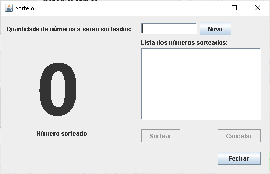

# Interface gráfica para a roleta eletrônica usando a IDE NetBeans.

## Contextualização

 - Esta é uma versão do sistema para a IDE NetBeans.  
 - O projeto no NetBeans deve ser chamado FrmSorteio_v2. 
 - Este programa possui diversas classes organizada nos pacotes, principal, modelo e visao. 
 - A pasta src contêm os fontes do projeto. 
 - A interface gráfica foi construída **com** o auxílio da IDE NetBeans. 

### Interface gráfica

Desenvolva um programa para uma roleta eletrônica. 
Esta roleta será utilizada em bingos ou rifas. 
O botão "Novo" inicializa a roleta com  quantidade de números a ser sorteados. 
O botão "Sortear" gera um número aleatório até a quantidade. 
O botão "Cancelar" a interrompe o sorteio. 
O botão "Fechar" encerra a aplicação.​

## Arquivos

- pom.xml - Arquivo de configurção da ferramenta de automação Maven.